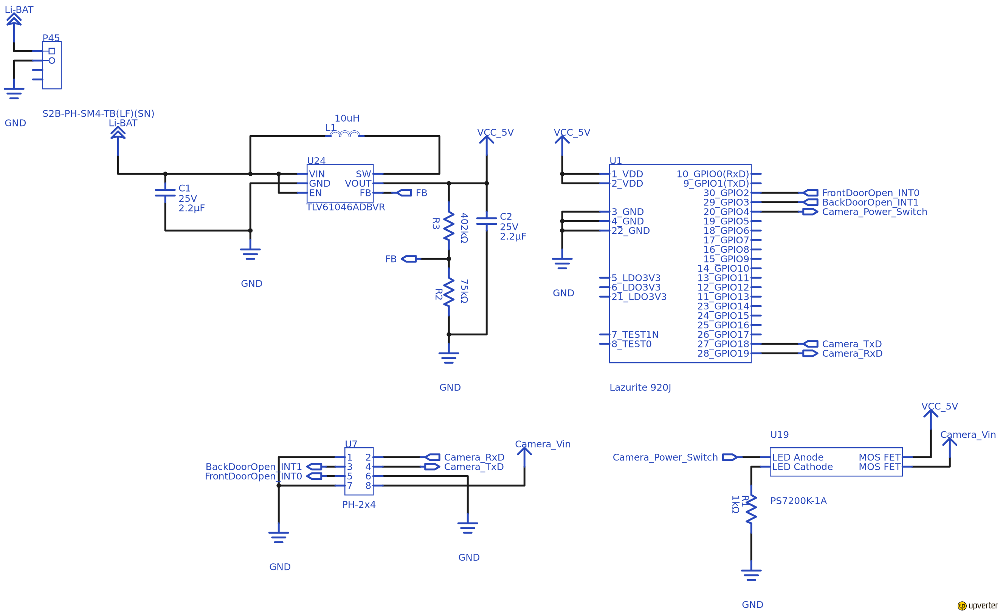
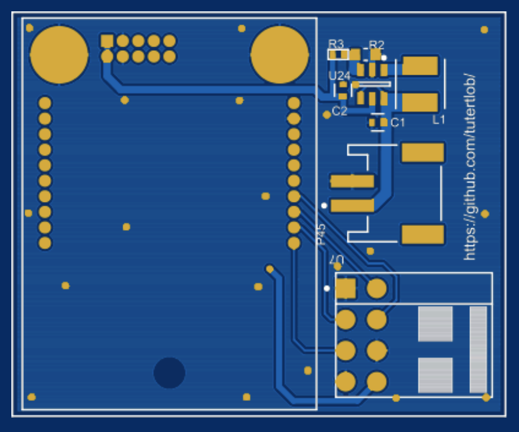
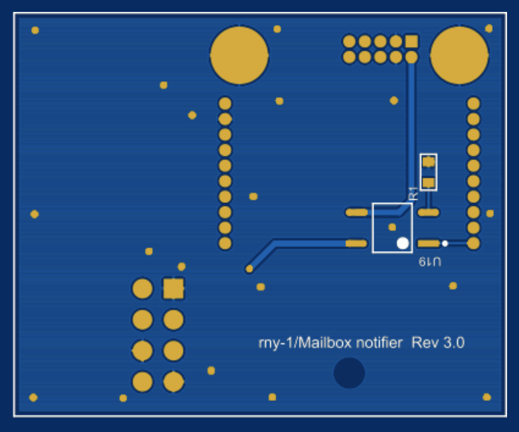

:Author: Reiji-N
:Email: nishiyama.reiji@gmail.com
:Date: 23/06/2019
:Revision: version#
:License: MIT
:Project: Mailbox_sender

= Project: {Project}

This http://www.lapis-semi.com/lazurite-jp/products[Lazurite] project is a part of rny-2.

This measures moisture in soil of flower pots and remind you to pour water.

== Step 1: Installation

1. Download this project.
2. Open SoilMoistureMonitor.c with the Lazurite IDE.
3. Build it and upload the output onto your Lazurite module.

== Step 2: Assemble the circuit

See the Schematic, PCB and BOM.

Mount components listed in the BOM onto the PCB.

== Schematic

.Schematic

== PCB design

SoilMoistureMonitor_gerber.zip is the gerber file for the PCB.
See also https://upverter.com/design/reiji-n/384e40da79d8f150/mailbox-notifier-ver-30/[the Upverter project] for more detail.

.PCB top view

.PCB bottom view

=== BOM

|===
| ID | Part name      | Part number | Quantity
| R1 | 1Kohm Resistor 0603 SMD  | ESR03EZPJ102 | 1       
| R2 | 75Kohm Resistor 0603 SMD  | RR0816P-753-D | 1   
| R3 | 402Kohm Resistor 0402 SMD  | ERJ2RKD4023X | 1   
| C1, C2 | 2.2uF Capacitor 0402 SMD  | GRM155R61C225KE11D | 2 
| L1 | 10uH Inductor | LQH43PH100M26L            | 1             
| S1 | Reed Switch    |             | 2 
| U1 | Lazurite 920J |             | 1        
| U7 | 2.54mm pin header | PH-2x4 Dual row, Right angle | 1 
| U19 | OCMOS FET | PS7200K-1A        | 1   
| U24 | Switching Voltage Regulators | TLV61046ADBVR | 1 
| M1 | Capative Soil Moisture Sensor |             | 1 
| M2 | Soil Moisture Sensor from XCSOURCE |             | 1        
| P45 | PH connector | S2B-PH-SM4-TB(LF)(SN) | 1 
| | LiPo battery | | 1 
|===

M1 and M2 are selective.

=== License
This project is released under a {License} License.

